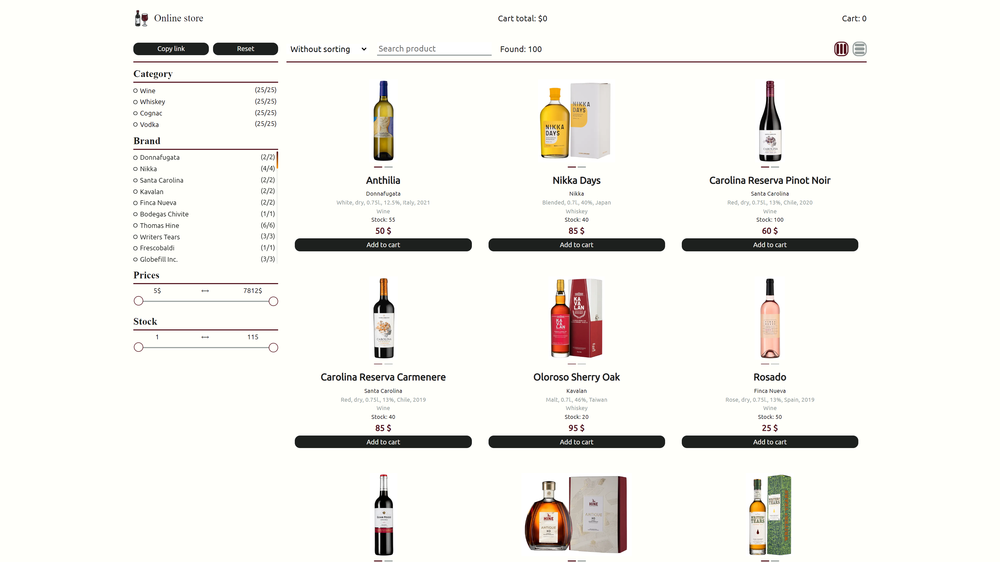

# **Vladimir Kozlachkov**

## **Contacts**

- **E-mail:** kozlachkovvd@gmail.com
- **GitHub:** [RussianBoy64](https://github.com/RussianBoy64)
- **Phone:** +7 (927) 050-79-40
- **Telegram:** [@vld_k64](https://t.me/vld_k64)
- **Location:** Saratov, Russia

## **About me**

In September 2021, I first thought about changing my profession. I have always been attracted to information technology, but it was much more difficult to decide on a specialization.

I decided to start with the basics and signed up for [CS50's Introduction to Computer Science](https://www.edx.org/course/introduction-computer-science-harvardx-cs50x) which became a good starting point for me and lifted the veil of secrecy over the world of information technology.

On the course, I had to solve many interesting tasks, from writing simple programs such as encrypting messages or determining the difficulty of reading text written on “C” language, and ending with writing an application that simulates trading in securities with authorization, working with an external API and database (SQLite), implementation of the BackEnd and FrontEnd parts.

This course kindled in me an unprecedented interest and desire to work and develop in the IT field, and also helped me to clearly define the future vector of my development as a FrontEnd developer.

### **My strengths:**

- Quick lerner
- Responsible
- Sociable
- Team player

## **Skills**

- HTML5 (semantic layout)
- CSS (SASS/SCSS, BEM)
- JavaScript (JS Basics, ES6 syntax)
- Git/GitHub
- React
- Redux
- Typescript

## **Experience**

### **React Quiz**

**Description:**

My first This is an educational single page application that allows you to create tests
with the ability to store and retrieve a list of tests from a database located in the cloud.\
The application was implemented as part of the React learning course.

**Technology:**

- React (React Router, axios)
- Redux
- CSS
- FireBase

**Source:** [Watch source code](https://github.com/RussianBoy64/react-quiz)

**Deploy:** [Watch deploy](https://react-quiz-517eb.firebaseapp.com/quiz/-MymLCZ9bNx_6Juweqln)

**Preview:**

### **Momentum**

**Description:**

An analogue of the Chrome Web Store application of the same name. The application shows the time and username. The background image and greeting changes depending on the time of day.
The application has a clock, an image slider, weather widgets, an audio player, a quote of the day block, and settings. Local storage is used to store the username and location.

**Technology:**

- HTML
- SCSS
- JS (fetch, async/await, api)
- Webpack

**Source:** [Watch source code](https://github.com/RussianBoy64/RSPRESchool/tree/momentum)

**Deploy:** [Watch deploy](https://rolling-scopes-school.github.io/russianboy64-JSFEPRESCHOOL2022Q2/momentum/)

**Preview:**

### **Eldritch Horror**

**Description:**

Application-helper for table game Eldritch Horror. This app helps to shuffle the decks to play according to the rules depending on the difficulty level and the choice of the ancient.

**Technology:**

- HTML
- SCSS
- JS
- Webpack

**Source:** [Watch source code](https://github.com/RussianBoy64/RSPRESchool/tree/codejam-eldritch)

**Deploy:** [Watch deploy](https://rolling-scopes-school.github.io/russianboy64-JSFEPRESCHOOL2022Q2/codejam-eldritch/)

**Preview:**

### **Bird Song**

**Description:**

Quiz application for recognizing birds by their voices. DOM-tree made with pure JS.

**Technology:**

- HTML
- SCSS
- JS
- Webpack

**Source:** [Watch source code](https://github.com/RussianBoy64/RSSchool/tree/birdsong)

**Deploy:** [Watch deploy](https://rolling-scopes-school.github.io/russianboy64-JSFE2022Q3/birdsong/)

**Preview:**

### **GEM Puzzle**

**Description:**

Game is a sliding puzzle that consists of a frame of numbered square tiles in random order with one tile missing. The object of the puzzle is to place the tiles in order by making sliding moves that use the empty space.

**Technology:**

- HTML
- SCSS
- JS
- Webpack

**Source:** [Watch source code](https://github.com/RussianBoy64/RSSchool/tree/gem-puzzle)

**Deploy:** [Watch deploy](https://rolling-scopes-school.github.io/russianboy64-JSFE2022Q3/gem-puzzle/)

**Preview:**

### **Online Store**

**Description:**

Online store of alcoholic products made in a team of 2 people. Ability to filter products, get query-params and much more.

**Technology:**

- HTML
- SCSS
- Webpack
- React
- Redux
- Typescript

**Source:** [Watch source code](https://github.com/RussianBoy64/OnlineStore/)

**Deploy:** [Watch deploy](https://aleksandrabulova-russianboy64-onlines.netlify.app/)

**Preview:**

### **Racoon Phone**

**Description:**

Simple clone of [Gartic phone](https://garticphone.com/ru) application.

**Technology:**

- HTML
- CSS
- Webpack
- React/Redux
- Typescript
- Socket.io
- Node.js

**Source:** [Watch source code](https://github.com/RussianBoy64/RacoonPhone)

**Deploy:** [Watch deploy](https://librebay.com/)

**Preview:**

## **Education**

- **University:** Saratov State Socio-Economic University, Marketing
- **Courses:**
  - [CS50's Introduction to Computer Science](https://www.edx.org/course/introduction-computer-science-harvardx-cs50x)
  - [#JavaScript30](https://javascript30.com/)
  - [ReactJS. Practical course 2020](https://www.udemy.com/course/react-2020-complete-guide/)
  - [RSSchool. Pre-School 2022](https://rs.school/)
  - [RSSchool. School Front-end 2022Q3](https://rs.school/js/)

## **Languages**

- **Russian** - native language
- **English** - A2
