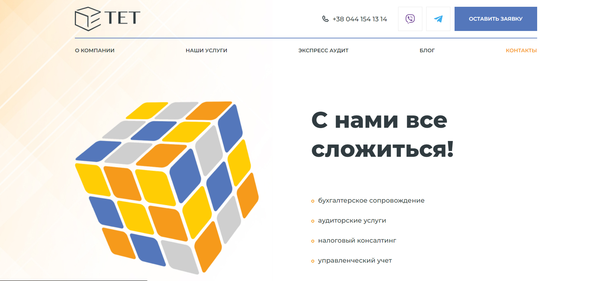
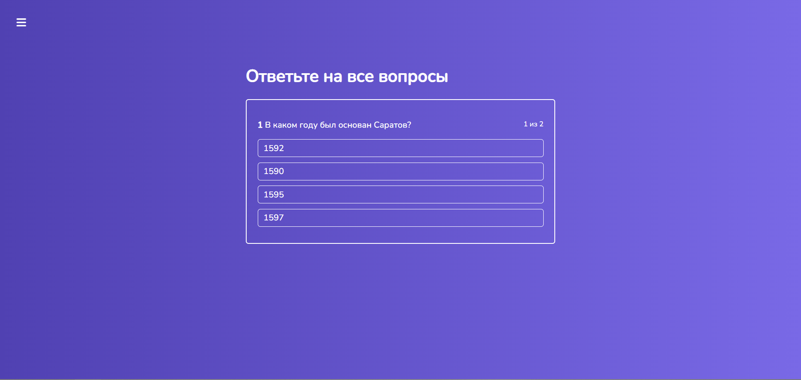
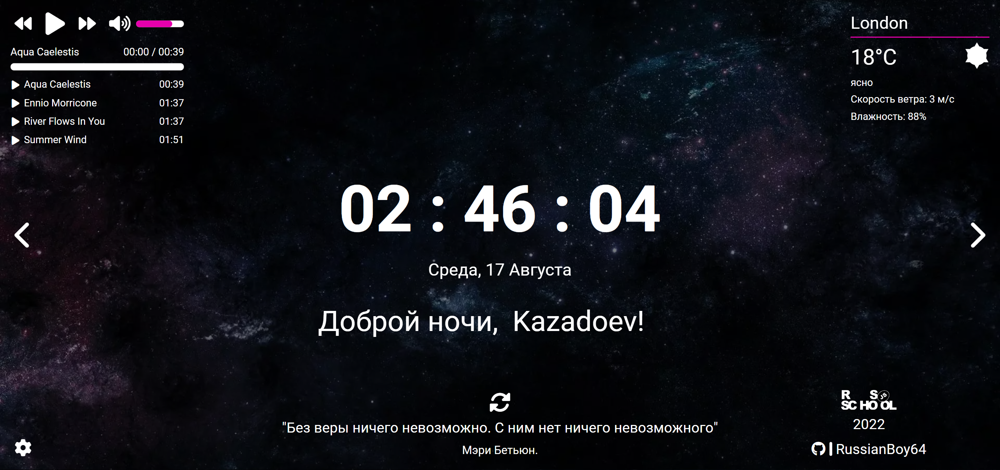

# **Vladimir Kozlachkov**

## **Contacts**

- **E-mail:** kozlachkovvd@gmail.com
- **GitHub:** [RussianBoy64](https://github.com/RussianBoy64)
- **Phone:** +7 (927) 050-79-40
- **Telegram:** [@vld_k64](https://t.me/vld_k64)
- **Location:** Saratov, Russia

## **About me**

In September 2021, I first thought about changing my profession. I have always been attracted to information technology, but it was much more difficult to decide on a specialization.

I decided to start with the basics and signed up for [CS50's Introduction to Computer Science](https://www.edx.org/course/introduction-computer-science-harvardx-cs50x) which became a good starting point for me and lifted the veil of secrecy over the world of information technology.

On the course, I had to solve many interesting tasks, from writing simple programs such as encrypting messages or determining the difficulty of reading text written on “C” language, and ending with writing an application that simulates trading in securities with authorization, working with an external API and database (SQLite), implementation of the BackEnd and FrontEnd parts.

This course kindled in me an unprecedented interest and desire to work and develop in the IT field, and also helped me to clearly define the future vector of my development as a FrontEnd developer.

### **My strengths:**

- Quick lerner
- Responsible
- Sociable
- Team player

## **Skills**

- HTML5 (semantic layout)
- CSS (SASS/SCSS, BEM)
- JavaScript (JS Basics, ES6 syntax, async, fetch)
- Git/GitHub
- React (React Router, React Transition Group)

## **Code Examples**

#### **Task name: [ROT13](https://www.codewars.com/kata/530e15517bc88ac656000716/javascript)**

#### **Task details:**

ROT13 is a simple letter substitution cipher that replaces a letter with the letter 13 letters after it in the alphabet. ROT13 is an example of the Caesar cipher.

Create a function that takes a string and returns the string ciphered with Rot13. If there are numbers or special characters included in the string, they should be returned as they are. Only letters from the latin/english alphabet should be shifted, like in the original Rot13 "implementation".

#### **Algorithm:**

1. Create an array character-by-character splitting message
2. Iterate over an array from beginning to end
3. Get ascii code of character at each step
4. If the character is a letter, encrypt it
5. Сoncatenate the entire array into a message

#### **Solution:**

```
function rot13(message){
  let cipher = message.split('')
  for (let i = 0; i < cipher.length; i++) {
    let ascii = cipher[i].charCodeAt(0)
    if (ascii >= 65 && ascii <= 90) {
      ascii += 13
      if (ascii > 90) ascii -= 26
    }

    if (ascii >= 97 && ascii <= 122) {
      ascii += 13
      if (ascii > 122) ascii -= 26
    }

    cipher[i] = (String.fromCharCode(ascii))
  }
  return cipher.join('')
}
```

## **Experience**

### **TET Landing**

**Description:**

My first independent educational project responcive landing page of an audit company.

**Technology:**

- HTML
- CSS (responcive design)
- JS
- Git/GitHub

**Source:** https://github.com/RussianBoy64/Portfolio/tree/main/01%20TET%20Landing

**Deploy:** https://russianboy64.github.io/Portfolio/01%20TET%20Landing/

**Preview:**

[](https://russianboy64.github.io/Portfolio/01%20TET%20Landing/)

### **React Quiz**

**Description:**

My first This is an educational single page application that allows you to create tests
with the ability to store and retrieve a list of tests from a database located in the cloud.\
The application was implemented as part of the React learning course.

**Technology:**

- React (React Router, axios)
- Redux
- CSS
- FireBase
- Git/GitHub

**Source:** https://github.com/RussianBoy64/react-quiz

**Deploy:** https://react-quiz-517eb.firebaseapp.com/quiz/-MymLCZ9bNx_6Juweqln

**Preview:**

[](https://react-quiz-517eb.firebaseapp.com/quiz/-MymLCZ9bNx_6Juweqln)

### **Travel landing**

**Description:**

Simple travel landing page with responcive design. Basic functional of this project is: burger-menu, adaptive image slider, sign-in and sign-up popup.

**Technology:**

- HTML
- CSS
- JS
- Git/GitHub

**Source:** https://github.com/rolling-scopes-school/russianboy64-JSFEPRESCHOOL2022Q2/tree/travel

**Deploy:** https://rolling-scopes-school.github.io/russianboy64-JSFEPRESCHOOL2022Q2/travel/

**Preview:**

[](https://rolling-scopes-school.github.io/russianboy64-JSFEPRESCHOOL2022Q2/travel/)

### **Momentum**

**Description:**

An analogue of the Chrome Web Store application of the same name. The application shows the time and username. The background image and greeting changes depending on the time of day.
The application has a clock, an image slider, weather widgets, an audio player, a quote of the day block, and settings. Local storage is used to store the username and location.

**Technology:**

- HTML
- SCSS
- JS (fetch, async/await, api)
- Git/GitHub
- Webpack

**Source:** https://github.com/rolling-scopes-school/russianboy64-JSFEPRESCHOOL2022Q2/tree/momentum

**Deploy:** https://rolling-scopes-school.github.io/russianboy64-JSFEPRESCHOOL2022Q2/momentum/

**Preview:**

[](https://rolling-scopes-school.github.io/russianboy64-JSFEPRESCHOOL2022Q2/momentum/)

### **Eldritch Horror**

**Description:**

Application-helper for table game Eldritch Horror. This app helps to shuffle the decks to play according to the rules depending on the difficulty level and the choice of the ancient.

**Technology:**

- HTML
- SCSS
- JS
- Git/GitHub
- Webpack

**Source:** https://github.com/rolling-scopes-school/russianboy64-JSFEPRESCHOOL2022Q2/tree/codejam-eldritch

**Deploy:** https://rolling-scopes-school.github.io/russianboy64-JSFEPRESCHOOL2022Q2/codejam-eldritch/

**Preview:**

[](https://rolling-scopes-school.github.io/russianboy64-JSFEPRESCHOOL2022Q2/codejam-eldritch/)

## **Education**

- **University:** Saratov State Socio-Economic University, Marketing
- **Courses:**
  - [CS50's Introduction to Computer Science](https://www.edx.org/course/introduction-computer-science-harvardx-cs50x)
  - [#JavaScript30](https://javascript30.com/)
  - [ReactJS. Practical course 2020](https://www.udemy.com/course/react-2020-complete-guide/)
  - [RSSchool. Pre-School 2022](https://rs.school/)

## **Languages**

- **Russian** - native language
- **English** - A2
